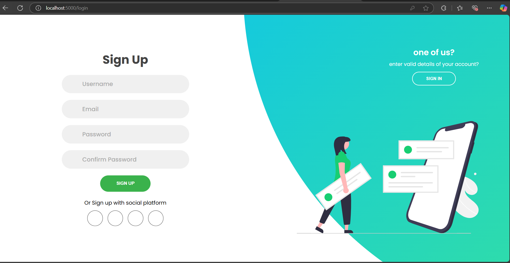
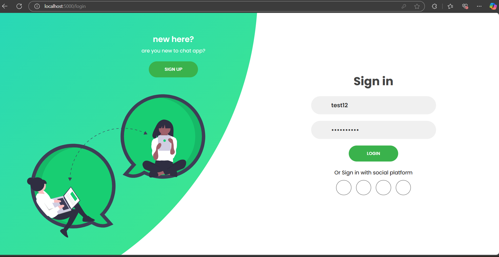
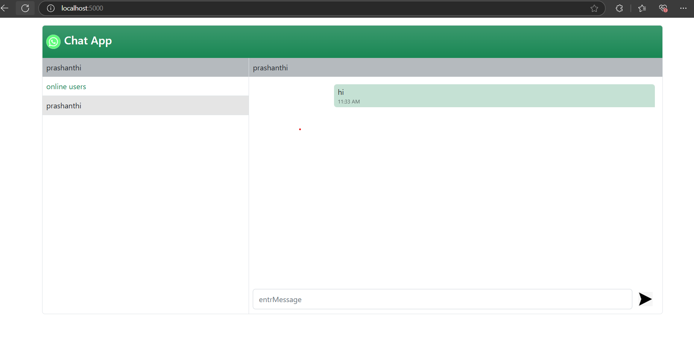

# Real-Time Chat Application

## Overview
This is a real-time chat application built using Node.js, Express, and Socket.IO. The application allows users to log in with a username, chat with other users in real-time, and view their chat history.





## Features
- Real-Time Messaging: Users can send and receive messages instantly.
- User Authentication: Users can log in with a unique username.
- Session Management: User sessions are managed using `express-session`.
- User List: Displays a list of online users.
- Chat History: Messages are stored in MongoDB, allowing users to retrieve their chat history.
- Responsive Design: The chat interface is designed to work on various screen sizes.

## Technologies Used
- Node.js: JavaScript runtime for building the server.
- Express: Web framework for Node.js to handle routing and middleware.
- Socket.IO: Library for real-time web applications to enable bi-directional communication.
- MongoDB: NoSQL database for storing user data and chat messages.
- Bootstrap: CSS framework for styling the chat interface.

## Installation

1. Clone the Repository:
   ```bash
   git clone https://github.com/prashanthimudepaka/chat-app.git
   cd chat-app
   ```

2. Install Dependencies:
   Make sure you have Node.js installed. Then run:
   ```bash
   npm install
   ```

3. Set Up Environment Variables:
   Create a `.env` file in the root directory and add your MongoDB connection string:
   ```plaintext
   MONGODB_URI=mongodb+srv://<username>:<password>@cluster0.mongodb.net/chat-app?retryWrites=true&w=majority
   PORT=5000
   ```

4. Start the Server:
   Run the following command to start the server:
   ```bash
   node index.js
   ```

5. Access the Application:
   Open your web browser and navigate to `http://localhost:5000/chat`.

## Usage
- Enter a username in the login form and click "Submit".
- Once logged in, you can see the list of online users and start chatting.
- Messages will appear in real-time, and you can view your chat history.

## Contributing
Contributions are welcome! If you have suggestions for improvements or new features, feel free to open an issue or submit a pull request.

## Acknowledgments
- [Socket.IO](https://socket.io/) for real-time communication.
- [Express](https://expressjs.com/) for building the web server.
- [MongoDB](https://www.mongodb.com/) for data storage.
- [Bootstrap](https://getbootstrap.com/) for styling the application.
